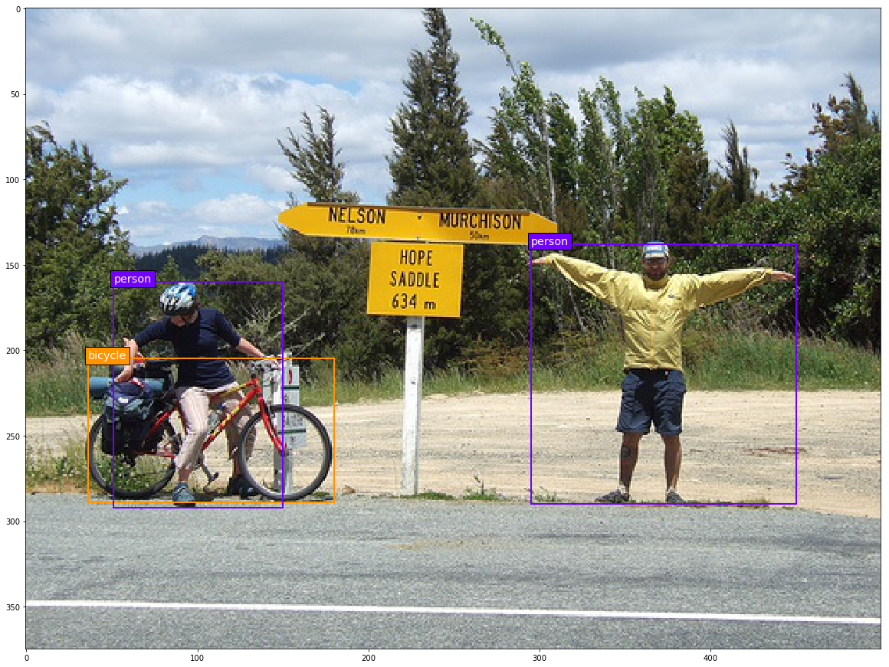
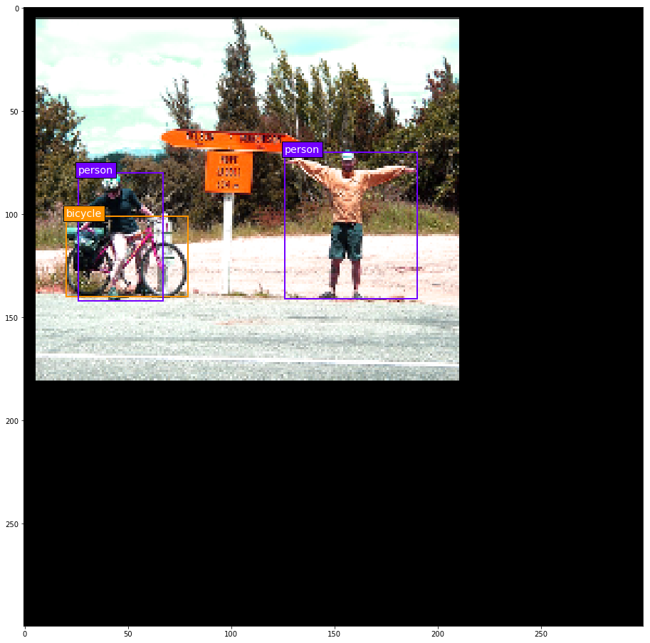
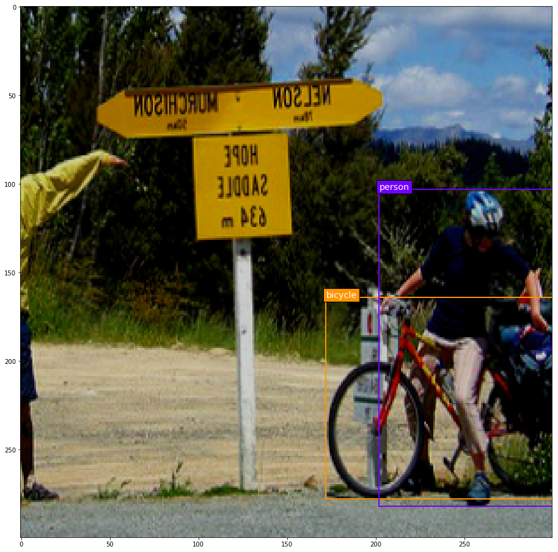

## Data Generator for 2D Object Detection
---

| | |
|---|---|
|  |  |
|  |  |

### Contents

1. [Overview](#overview)
2. [Dependencies](#dependencies)
3. [How to use it](#how-to-use-it)

### Overview

This is a data generator for 2D object detection with axis-aligned rectangular bounding boxes. Its main focus is on flexible and easily extensible data augmentation capabilities.

Main features:
* Lets you easily define arbitrary chains of image transformations.
* Provides most common photometric and geometric image transformations out of the box.
* Provides both random and deterministic versions of all image transformations.
* Provides flexible options for how to decide whether a random transformation of an image is "valid" (see tutorial).
* Provides parsers for ground truth annotations in the MS COCO (JSON) and Pascal VOC (XML) formats as well as for a wide range of CSV formats.

### Dependencies

* Python 3.x
* Numpy
* OpenCV
* Beautiful Soup 4.x

Python 2 compatibility: This implementation seems to work with Python 2.7, but I don't provide any support for it. It's 2018 and nobody should be using Python 2 anymore.

### How to use it

Everything you need to know in order to use this data generator is explained in the following Jupyter notebook tutorial:

* [Data Generator Tutorial](data_generator_tutorial.ipynb)
